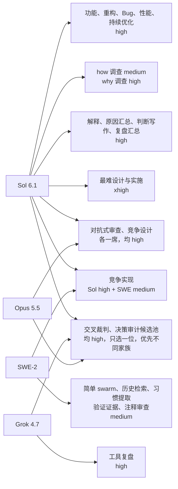

# pstack 0.15.15 升级记录

对应 GitHub [spec #18](https://github.com/larryboiNEUQ/pi-pstack/issues/18) 和 [ticket #19](https://github.com/larryboiNEUQ/pi-pstack/issues/19)。本记录是当时的 pin、适配变化和验证快照，不是安装证明。

## 固定源

- 上游是官方 cursor/plugins 提交 `df581122cde17e6e27686b5a448bde23e4ad4318`，pstack manifest 0.15.15。这是固定快照，不跟踪 HEAD。
- 默认从固定快照生成。要用本地上游克隆时，设 `PSTACK_UPSTREAM_REPO` 指向克隆根，生成和测试都读它。

```sh
PSTACK_UPSTREAM_REPO=/absolute/path/to/plugins-clone npm run generate
PSTACK_UPSTREAM_REPO=/absolute/path/to/plugins-clone npm test
```

## 本次上游变化（适配侧）

- 新增 `poteto-help` 进包，并已修正其中 Cursor 专属的宿主表述为 Pi。
- 上游官方将四个面板的默认列表改为 Claude 与 Grok，`reflect tooling` 改为 Grok。
- 上游预算默认为 `large`，对应 `xhigh`。本适配仍将上游 `max` 映射为 `xhigh`，不代表 Pi 本身不支持 `max`。
- 本仓库采用下方用户批准的项目分配，不照搬上游默认。
- 生成包为 53 个技能。裸名 `tdd` 和 `teach` 仍不进包。
- 本轮没有修改 `~/.agents/skills`、`~/.pi/agent` 或任何用户级设置，也没有执行安装。

## 批准的项目角色分配

[Ticket #21](https://github.com/larryboiNEUQ/pi-pstack/issues/21) 记录这次分配。完整 22 行在 `adapted/config/models.md`。Sol 对应 `openai/gpt-6.1-sol`，SWE 对应 `devin/swe-2`，Grok 对应 `xai/grok-4.7`，Opus 对应 `devin/claude-opus-5.5`。

Sol 负责主要实施和判断。SWE 的免费情况由用户提供，本次没有核验计费。审查和设计用 Sol 与 Opus，竞争实现用 Sol 与 SWE。Grok 保留工具复盘和裁判候选。Thinking 按角色混合，setup 仅在用户明确要求统一预算时才统一档位。



`swarm workers` 默认 SWE 只接明确、可验收的小任务。复杂分块由派发者显式改用 Sol `high` 或最难任务的 `xhigh`。模型表没有自动难度分类器。

## 生成与验证状态

- `npm run generate` 已成功，产出 53 个技能，四份清单合计 201 条改动。改动条数以 `adaptation/changes.json`、`host-changes.json`、`path-changes.json`、`setup-changes.json` 为准。
- 升级前全量基线 `npm test` 为 104/104 通过。
- 升级后的完整 `npm test` 为 108/108 通过。覆盖完整 22 行项目分配、配置种子一致性、生成器、安装器 fixture、真实 Pi SDK 的技能加载和帮助命令展开。
- 从固定提交独立生成副本，逐项比较 SHA-256、文件模式和链接目标。`adapted/` 的 141 个文件与教程的 19 个文件均一致。
- `npm run test:installed` 未运行。
- CI 未配置，CI 证据不可用。

## 可复跑命令

```sh
npm run generate                                            # 固定 pin 重新生成
node --test test/generate.test.mjs test/pi-load.test.mjs    # 窄范围生成器与 Pi 加载验证
npm test                                                    # 全量本地测试
```

仅比较内容时，可先复制当前生成树，重新生成后运行以下命令。文件模式和链接目标另外检查。本轮独立生成比较已包含这两项。

```sh
export PSTACK_UPSTREAM_REPO=/absolute/path/to/plugins-clone
before=$(mktemp -d)
cp -pR adapted "$before/adapted"
cp -pR docs/upstream-guide "$before/upstream-guide"
npm run generate
diff -r "$before/adapted" adapted
diff -r "$before/upstream-guide" docs/upstream-guide
```
